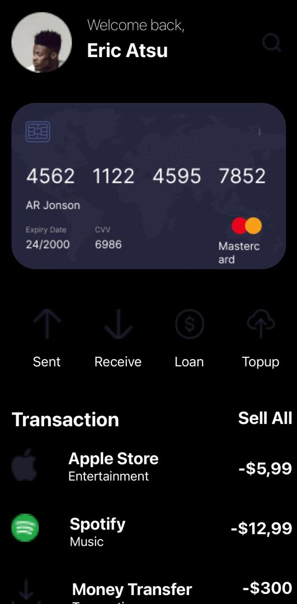
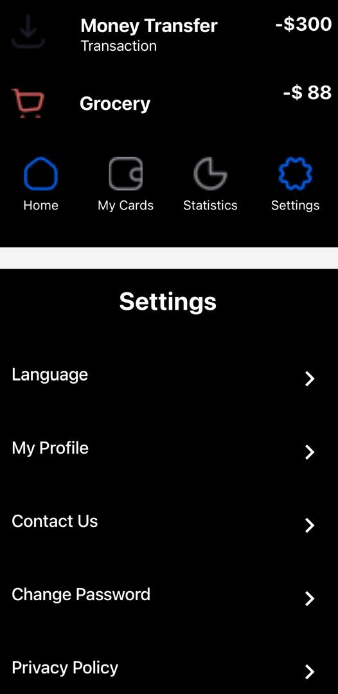

# rn-assignment5-11358166

Homescreen Features:
Header Section:
A rounded image located at the far left corner.
Texts positioned beside and beneath the rounded image.
A search icon situated at the far right corner of the screen.

Transactions Section:
Text "Transactions" positioned on the far left.
Text "Sell All" positioned on the far right.
Below "Transactions," images are aligned on the far left with accompanying texts beside and beneath it.
Below "Sell All," monetary figures ("- $5.99") indicating financial status.

Bottom Navigation:
Four buttons featuring images.
Texts beneath each button providing context or functionality.
Equal spacing between each button.
Settings Screen Features:

Header Section:
Text "Settings" in bold, centered at the top of the screen.
Settings Options:

List of settings options displayed vertically.
Each option structured with text on the left and a ">" symbol on the far right:
"Language"
"My Profile"
"Contact Us"
"Change Password"
"Privacy Policy"
Theme Setting:
Below the list of settings options, a section labeled "Theme."
Includes a switch button to toggle between light and dark themes.

Bottom Navigation:
Four images with texts beneath them.
Positioned at the bottom of the screen, providing additional navigation or functionality.

This is the Structure of the Application:

Technology Stack: Built using React Native, leveraging its components and navigation features.

Styling: Utilizes stylesheets for consistent UI design across screens, including rounded images, text alignments, and button layouts.

Navigation: Implemented with React Navigation for seamless transitions between the Homescreen and Settings screen.

Functionality: Incorporates state management for the theme switch functionality and handles user interactions such as button presses and theme changes.

A brief description of the Components been used in the App.

View: The fundamental building block for UI elements. It groups other components and defines layout using props like flex, flexDirection, alignItems, justifyContent, and more.

ScrollView: Enables scrolling functionality within a container. Useful for content that might exceed the size of the screen.

Text: Displays textual content. Use props like fontSize, fontWeight, color, and fontFamily to style the text.

StyleSheet: A central location to define styles (like colors, fonts, margins, padding) that can be applied consistently across your components. This promotes code reusability and maintainability.

FlatList: Components for rendering large lists of data efficiently. Use FlatList for simple homogeneous lists. Define data (the list of items), renderItem (function to render each item), and keyExtractor (function to uniquely identify each item) for optimal performance.

Image: Displays an image from a local file or remote URL. Use props like source (image path), resizeMode (how to scale the image), and style to make the image look exactly how you want it to look like.

The Screenshots of the App can be found below:

